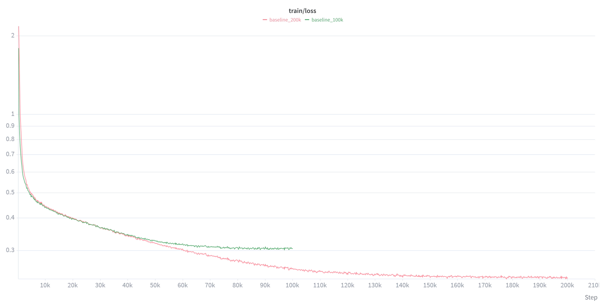
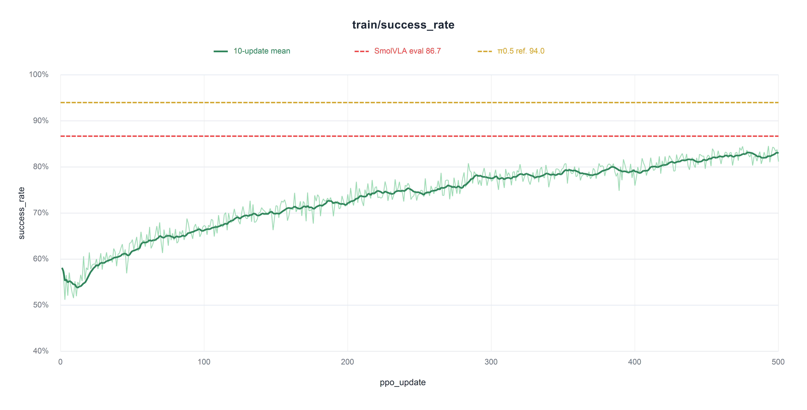

# Offline-to-Online Robot Learning on LIBERO

An implementation study of behavior cloning, successful-trajectory augmentation,
and Flow-Noise PPO for **SmolVLA-0.24B** on LIBERO. The project examines where
offline imitation stops improving task success and implements online policy
optimization from the BC checkpoint.

## Highlights

- Converted the image-heavy LIBERO dataset to **Lance** for higher-throughput BC
  training.
- Found that lower flow-matching loss from longer BC training did not imply
  higher evaluation success.
- Collected 10 successful rollouts per task for a self-imitation experiment;
  the added successes alone did not produce a clear improvement.
- Implemented Flow-Noise PPO for a 0.24B VLA. On LIBERO-Long, it improved the
  BC-100k baseline from **58.9%** to **86.7%** evaluation success.

## Setup

Tested on Linux with CUDA 12.8 and an RTX 5090. Use your preferred Python
environment manager.

```bash
git clone https://github.com/siwooyong/lerobot.git
cd lerobot
git switch feature/robot-learning

pip install \
  torch==2.10.0 \
  torchvision==0.25.0 \
  torchaudio==2.10.0 \
  --index-url https://download.pytorch.org/whl/cu128

# The BC launcher decodes Lance images on CPU.
pip install --no-deps \
  torchcodec==0.10.0 \
  --index-url https://download.pytorch.org/whl/cpu

pip install -e ".[all]"
pip install lerobot-lancedb
```

Optional authentication for Hugging Face access and W&B experiment tracking:

```bash
hf auth login
wandb login
```

## Training budget

All experiments used **1× RTX 5090**: BC-100k took approximately **7 hours**,
BC-200k **14 hours**, and Flow-Noise PPO **112.5 hours**
(13.5 minutes/update × 500 updates).

## Results

### Behavior cloning

| Model | Spatial | Object | Goal | LIBERO-Long | Average |
| --- | ---: | ---: | ---: | ---: | ---: |
| SmolVLA-0.24B (reported, no VLA pre-training) | 87.0 | 93.0 | 88.0 | 63.0 | 82.8 |
| BC-100k, `n_action_steps=1` | 77.2 | 86.0 | 76.0 | 50.0 | 72.3 |
| BC-100k, `n_action_steps=10` | 78.4 | 84.4 | 83.2 | 58.8 | 76.2 |
| BC-200k, `n_action_steps=1` | 72.8 | 69.6 | 70.8 | 44.4 | 64.4 |
| BC-200k, `n_action_steps=10` | 74.0 | 75.6 | 85.2 | 51.6 | 71.6 |

BC scores use **25 episodes per task** with `denoise_steps=10`.



Although BC-200k continued to reduce training loss, it did not improve
evaluation success. Action chunking was also a material inference-time choice.

### Successful-trajectory augmentation

Starting from BC-100k, the project collects 10 successful episodes per LIBERO
task and adds them for additional imitation training. This self-imitation
experiment did not show a clear success-rate gain: successful demonstrations
increase coverage, but do not directly teach recovery at failure states.

### Flow-Noise PPO on LIBERO-Long

| Model | Method | Parameters | Evaluation success |
| --- | --- | ---: | ---: |
| SmolVLA-0.24B BC-100k, `n_action_steps=10` | Behavior cloning | 0.24B | 58.9% |
| SmolVLA-0.24B, `n_action_steps=10` | Flow-Noise PPO | 0.24B | **86.7%** |
| π0 | Flow-Noise PPO (reported) | 3.3B | 93.8% |
| π0.5 | Flow-Noise PPO (reported) | 3.0B | 94.0% |

RL scores use **100 episodes per task** with `denoise_steps=4`.



The green curve is the macro-average on-policy rollout success across the 10
LIBERO-Long tasks. The red line is the SmolVLA evaluation result; the yellow
line is the reported π0.5 reference, not a directly matched run.

## Evaluation protocol

Reported suite scores are the macro-average of per-task success rates. The
episode count and denoising configuration are stated with each experiment.

## Reproduction

Run commands from the LeRobot repository root after completing setup.

### Behavior cloning

```bash
lerobot-convert-to-lance \
  --repo-id=HuggingFaceVLA/libero \
  --output=outputs/datasets/libero_lance \
  --jpeg-quality=100 \
  --jpeg-subsampling=0
bash projects/robot_learning/scripts/train_bc.sh
```

### Collect successful rollouts

```bash

bash projects/robot_learning/scripts/collect_success.sh
lerobot-convert-to-lance \
  --repo-id=siwooyong/libero-smolvla-success-rollouts \
  --src-root=outputs/datasets/libero_success_rollouts \
  --output=outputs/datasets/libero_success_rollouts_lance
```

### Online RL from the BC-100k checkpoint

```bash

bash projects/robot_learning/scripts/train_rl.sh
bash projects/robot_learning/scripts/test.sh
```

`train_bc.py` replaces only LeRobot's dataset construction with a local
Lance-backed loader; model construction, optimization, checkpointing, and
evaluation remain LeRobot's implementations.

The successful-rollout collection and conversion are included; the historical
merged-dataset retraining invocation for that small ablation is not packaged as
a separate launcher.

## Code map

| Path | Purpose |
| --- | --- |
| `scripts/train_bc.py` | Lance-backed BC launcher |
| `scripts/collect_success.py` | Successful rollout collection |
| `dataset/success_data.py` | Dataset schema and episode recording helpers |
| `rl/train.py` | Online training entry point |
| `rl/actor.py`, `rl/critic.py`, `rl/ppo.py` | Flow-Noise actor, value function, and PPO update |
| `rl/rollout.py` | LIBERO rollout collection and metrics |

## References

- [LeRobot](https://github.com/huggingface/lerobot)
- [SmolVLA](https://huggingface.co/blog/smolvla)
- [πRL](https://arxiv.org/abs/2510.25889)
- [RLinf](https://github.com/RLinf/RLinf)

## Scope

This is a project within a LeRobot fork, not a standalone robotics framework.
The implementation and experiment utilities live under `projects/robot_learning`.
